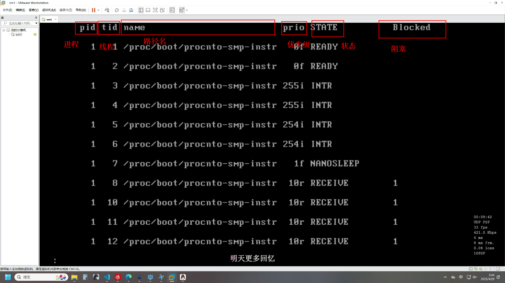

 ## 总结：
 QNX微内核核心机制：ICP、系统调度
 宏内核中属于内核的功能，大部分都变成了用户空间的进程
 ## QNX的设计哲学 极简主义与服务在内核之外
 1. 内核只包含最核心、最必不可少的内容。（微内核与FreeRTOS相似）
 2. 文件系统、设备驱动、网络协议栈、进程管理器等都做进了进程里面
 ## QNX微内核负责的事情

 1. 进程/线程调度。-根据调度策略决定那个任务运行
 2. 进程间通信 -ICP：消息传递机制(模型是服务端与客户端)
 3. 底层中断处理 - 硬件中断：根据接收到的硬件中断派发给内核外部的驱动程序
 4. 定时器 - 提供基本的定时服务
 ## 消息传递的基本模型：
1. 一个进程需要请求服务的时候，它会构建一个消息，通过内核提供的MsSend()api发送给提供服务的进程。
    - 这个消息的数据结构是什么
    - 客户端需要知道它向谁请求吗？
2. 内核负责将消息1从客户端的地址空间安全地传递到服务器的地址空间
3. 处理完毕后，服务器通过MsgReplay()将结果返回给客户端
    - 这个返回结果的数据结构是什么？
4. 在MsgSend()期间，客户端通常会阻塞、知道收到服务器的MsgReplay().
## 观察微内核
QXN虚拟机终端里面运行
    
    pidin<|less> 
    加上是为了配合shift+pageup/pagedn翻页查看
结果如下：

结果分析：

    PID:进程ID
    TID:线程ID.线程ID在该进程内唯一标识
    NAME:进程的可执行文件路径
    PrIO:线程优先级。数字越大优先级越高。（0、1~63、64~255）
        r:代表realtime调度策略
        i:代表interrupt线程（优先级255通常是保留给中断处理）
        n:代表normal调度策略（通常是other）
    State:线程当前的状态
        SIGWAITINFO：线程正在等待一个信号-阻塞
        CONDVAR：线程正在等待一个条件变量-通常用于线程间的同步，表示线程在等待某个限定条件变为真-阻塞
        RECEIVE：线程正在等待接收消息（IPC机制核心）此时blocked列数字代表在哪个通道上等待消息
        INTR：线程正在等待一个硬件中断这通常是设备驱动程序中的线程，等待硬件发出信号
        REPLY：线程因为发送而等待回复被阻塞
        Blocked:数字意思可能是：通道ID、连接ID、条件变量地址

